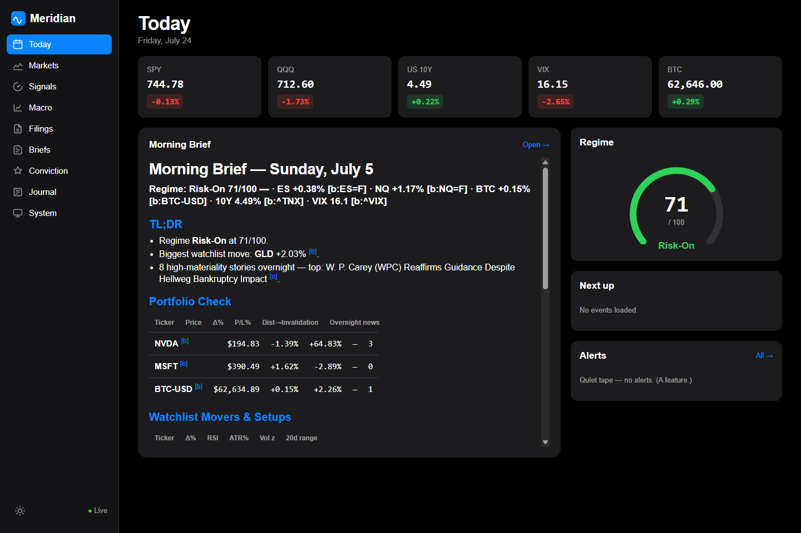
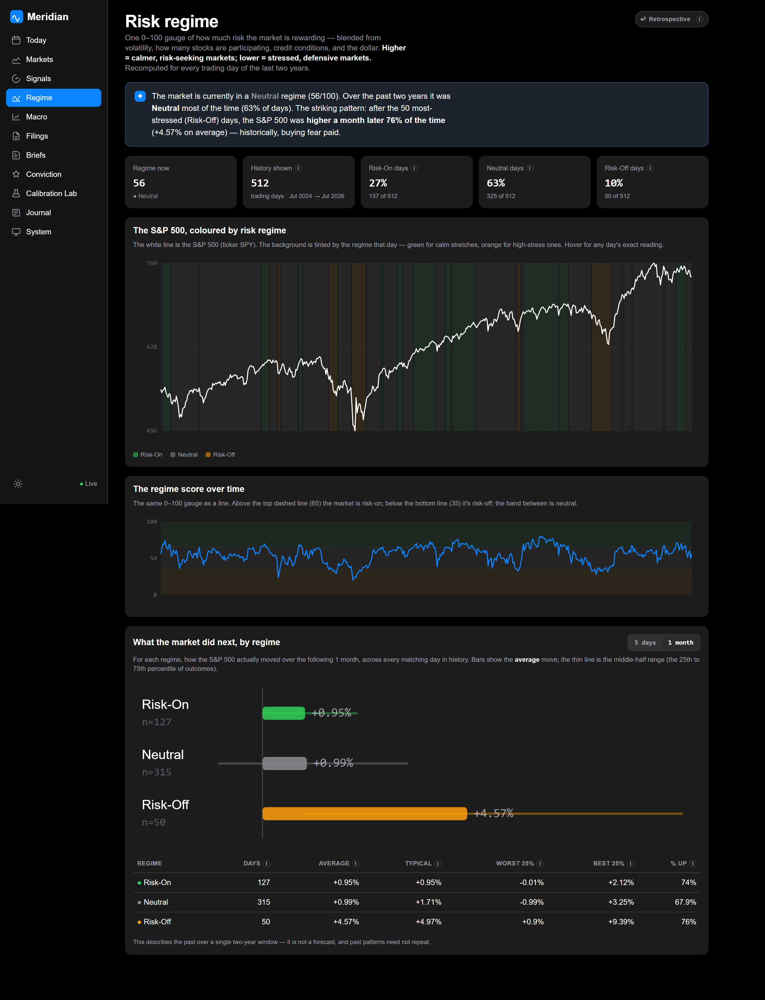
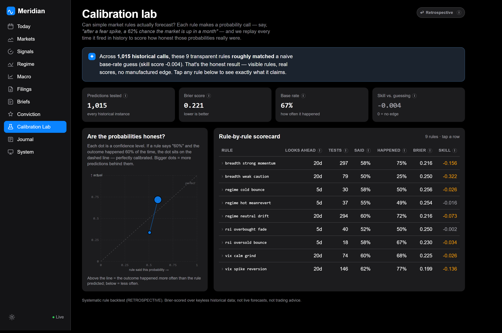

# Meridian

**A local-first market-intelligence daemon that enforces forecasting discipline.**

Meridian ingests equities, crypto, news, SEC filings, macro data, and prediction markets;
computes a composite risk regime; and runs an LLM-assisted analysis pipeline that produces
structured briefs. Its differentiator is the discipline layer: every forecast is Brier-scored
onto a calibration curve, and every trade thesis must pass a 10-item conviction gate plus an
automated red-team review before it can go "live." It ships with a frozen demo database, so a
reviewer can boot the whole system and browse real briefs, signals, and a calibration curve
**with zero API keys**.

It also runs **live with zero API keys** (`manage.py refresh` pulls today's quotes, Kalshi
public markets, RSS, and EDGAR), and validates its own regime model **retrospectively**: a
two-year backfill recomputes the composite regime over keyless history (Regime page), and a
systematic rule-backtest Brier-scores hundreds of ex-ante predictions onto a reliability curve
(Calibration Lab). Both are clearly labelled retrospective description — never a trading claim.

> Personal research tool. **Not investment advice.** Meridian prepares; the operator decides.
> It never executes trades.

## Why it's different

Most market tools generate ideas. Meridian is built to make a *decision process* repeatable
and to grade the forecaster over time:

- **Calibration engine.** Every conviction memo logs falsifiable predictions with a
  probability and a horizon. Price-checkable ones auto-resolve from bar data; Brier scores
  accumulate into a calibration curve (predicted vs realized frequency) and hit-rate
  breakdowns by edge type and direction. The system grades *you*, not just the market.
- **Conviction gate + red team.** A memo cannot reach "live" below a weighted 10-item gate
  score without a typed, journaled override. A top-tier model builds the strongest opposing
  case and pins it next to the thesis permanently.
- **Trust by construction.** Every number in a brief is traceable to a stored evidence row.
  A code fact-checker validates that every evidence marker resolves and every numeric claim
  matches its stored value before the brief is published.
- **$0, zero-key operation.** With no API keys the entire pipeline degrades to deterministic
  heuristics and a template renderer — fully cited, fully fact-checked. Keys upgrade paths;
  they are never required.

## Feature highlights

- Single always-on daemon (FastAPI + APScheduler) owning ingestion, signals, agents, and API.
- **Live keyless refresh** — `manage.py refresh` pulls today's data (yfinance quotes, Kalshi
  public REST, RSS, EDGAR) with per-connector success/failure reporting; partial failures never
  crash the run, and the dashboard shows a Snapshot-vs-Live freshness banner.
- **Historical regime validation** — `manage.py backfill-regime` recomputes the composite regime
  daily over ~2y of keyless history into `regime_history`; the Regime page charts the timeline,
  SPY with a regime-shaded backdrop, and forward-return distributions by bucket (in-sample).
- **Calibration Lab** — `manage.py backtest-rules` scores a transparent rulebook
  (`config/rules.yaml`) over history, producing 1,000+ resolved predictions on a reliability
  curve with Brier-skill scores; kept separate from live forecasts and labelled retrospective.
- Verified indicator math (matches a pandas reference to zero difference; property-tested).
- 8-component risk-regime composite (0–100) with hysteresis and transition alerts.
- Connector framework with per-source circuit breakers and stale-data flagging.
- SEC filing risk-factor diffing and Form 4 insider-cluster detection.
- Declarative alert-rule DSL with dedupe, cooldowns, quiet hours, and a noise governor.
- React 19 PWA dashboard with an Apple-style design system (light/dark).
- Private podcast feed for the morning brief; designed push-card notifications.

## Dashboard

Rendered from the committed zero-key snapshot — the Today dashboard (with its freshness
banner), the two-year Regime validation page, and the Calibration Lab rule-backtest:

| Today | Regime | Calibration Lab |
|---|---|---|
|  |  |  |

## Architecture

A single process (`meridiand`) owns scheduling, ingestion, signals, the agent pipeline, and
the API. SQLite (WAL) is the source of truth; bulk OHLCV history lives in Parquet queried via
DuckDB. Notifications route through one choke point across ntfy / Pushover / iMessage. The
dashboard is a static React PWA served by FastAPI. Everything is local-first and free-tier by
default. Full detail in [docs/ARCHITECTURE.md](docs/ARCHITECTURE.md).

```
external data → connectors → SQLite/Parquet → signal engine → agent pipeline
                                                   ↓                ↓
                                          alerts & notifier   briefs · memos · calibration
                                                   ↓                ↓
                                              push channels    REST + SSE → React PWA
```

## Quickstart

```bash
python -m venv .venv
.venv/Scripts/pip install -r requirements-core.txt          # POSIX: .venv/bin/pip ; or `uv sync`
# or, for the exact known-good pins: .venv/Scripts/pip install -r requirements.lock
python manage.py migrate                                    # idempotent (the demo DB is pre-migrated)
PYTHONPATH=src MERIDIAN_PORT=8788 .venv/Scripts/python -m meridian.app   # -> http://localhost:8788
```

`PYTHONPATH=src` puts the package on the path without an install step; alternatively run
`pip install -e .` once and the `meridiand` entry point works directly.

Then, in another shell:

```bash
curl -s localhost:8788/api/health | python -m json.tool
# -> {"overall": "green", "scheduler": {...}, "db_writable": true, "connectors": [...]}
# (overall reflects scheduler + DB + disk + connector freshness; on the frozen demo
#  snapshot connectors read "stale" until a live refresh, which is expected)
```

Build the dashboard (optional — the API and demo work without it):

```bash
cd web && npm install && npm run build                  # served by the daemon at /
```

## Zero-key demo

The repository ships with a **frozen demo database** at `data/meridian.db` — a real snapshot
captured 2026-07-05 containing 889 signal rows, 538 news items, 240 SEC filings, and 259
prediction markets, plus generated briefs and conviction memos with resolved predictions. No
API keys are needed to explore it; live mode simply refreshes the same tables.

After booting against the snapshot (Quickstart above), browse:

```bash
curl -s localhost:8788/api/briefs/latest?kind=morning   # a fully-cited morning brief
curl -s localhost:8788/api/signals                      # regime composite + indicators
curl -s localhost:8788/api/memos                        # the conviction kanban
curl -s localhost:8788/api/calibration                  # Brier scores + calibration curve
```

Or open `http://localhost:8788/` for the dashboard (once built) — Today, Conviction, and the
calibration view render directly from the snapshot.

## Live desk & retrospective validation (V2)

All keyless. The demo boots in **Snapshot** mode; `refresh` flips the freshness banner to
**Live**. The regime backfill and rule backtest are **retrospective** — historical description,
not forecasts, labelled as such in the UI.

```bash
python manage.py refresh              # live keyless pull (quotes/Kalshi/RSS/EDGAR); --dry-run to preview
python manage.py backfill-regime --years 2   # recompute the 2y composite regime -> regime_history
python manage.py backtest-rules       # Brier-score config/rules.yaml over history -> rule_predictions
make demo                             # migrate + boot on the committed snapshot (no network)
make live                             # refresh + boot showing current data
```

A representative run on this machine: `refresh` completed with **9/9 keyless connectors OK**
(Kalshi 260 markets, RSS 470, EDGAR 9, quotes 41); `backfill-regime` produced **512** daily
regime rows over 2y; `backtest-rules` generated **1,015** resolved predictions across 9 rules.
New surfaces: `GET /api/regime/history`, `/api/regime/forward-returns`, `/api/calibration/rules`,
`/api/system/freshness`.

## Configuration

Non-secret settings live in `config/meridian.yaml`; secrets live in `.env` (copy from
`.env.example`). Every key is optional — the connector marks itself `disabled` when absent.

| Variable | Purpose | Required? |
|---|---|---|
| `ANTHROPIC_API_KEY` | LLM analyst/composer path (else deterministic templates) | No |
| `FRED_API_KEY` | FRED macro series | No |
| `ALPACA_KEY_ID` / `ALPACA_SECRET_KEY` | Real-time IEX equity quotes | No |
| `FINNHUB_KEY` | Deeper company news | No |
| `SEC_USER_AGENT` | Contact string EDGAR requires (`Name email`) | For EDGAR |
| `NTFY_*` / `PUSHOVER_*` | Push notification channels | For push |
| `MERIDIAN_PORT` | Daemon port (default 8788) | No |
| `MERIDIAN_HOME` | Data/config root (default: repo root) | No |

## Testing

```bash
.venv/Scripts/python -m pytest      # 62 tests
.venv/Scripts/python -m ruff check src tests
```

Current status: **62 tests pass, `ruff` clean.** Indicators are verified against a pandas
reference; the conviction lifecycle, degrade-mode briefs (with fact-checking), the
backup/restore drill, and the V2 additions — live-refresh dry-run, regime backfill on a fixture
window, and the rule backtest — are all covered by hermetic (offline) tests. See
[docs/ROADMAP.md](docs/ROADMAP.md) for the full verified-vs-deferred breakdown.

## Project structure

```
src/meridian/
├── app.py            # FastAPI factory + APScheduler wiring
├── config.py db.py   # settings merge; SQLite + migration runner
├── connectors/       # one module per data source (circuit-broken, degradable)
├── signals/          # indicators, breadth, regime, regime_history (2y backfill), alert DSL
├── agents/           # LLM runner (structured tool-use, budget governor) + triage
├── briefs/           # analysts, composer, fact-checker, templates, audio, hedge
├── conviction/       # memos, gate checklist, red team, predictions, calibration, rulebook
├── notify/           # router + channels + standalone CLI
├── api/              # REST routers + one SSE channel
└── ops/              # health, cost governance, backup/restore, scheduler
config/               # meridian.yaml, alerts.yaml, rules.yaml (rulebook), launchd plists
migrations/           # numbered SQL (0003 adds regime_history + rule_predictions)
web/                  # React 19 + Vite PWA (builds to web/dist)
data/                 # committed demo snapshot (meridian.db + parquet)
docs/                 # architecture, decisions, runbook, roadmap, macOS deployment
tests/                # pytest suite
```

## Documentation

- [docs/ARCHITECTURE.md](docs/ARCHITECTURE.md) — how the system fits together and why.
- [docs/DECISIONS.md](docs/DECISIONS.md) — architecture decision records.
- [docs/RUNBOOK.md](docs/RUNBOOK.md) — start/stop/inspect commands.
- [docs/ROADMAP.md](docs/ROADMAP.md) — verified state, deployment steps, deferred backlog.
- [docs/deployment-macos.md](docs/deployment-macos.md) — the always-on macOS host setup.

## Roadmap & limitations

The core system is verified cross-platform. Push delivery to a phone, launchd crash/reboot
survival, PWA install, Piper audio, and threshold tuning are exercised on the always-on macOS
host (see the deployment guide). Live-mode LLM briefs require a key; without one the
deterministic path is used. Full detail in [docs/ROADMAP.md](docs/ROADMAP.md).

## License

MIT — see [LICENSE](LICENSE).
